<picture>
  <source media="(prefers-color-scheme: dark)" srcset="https://raw.githubusercontent.com/trailofbits/vscode-weaudit/main/media/banner-dark-mode.png">
  <source media="(prefers-color-scheme: light)" srcset="https://raw.githubusercontent.com/trailofbits/vscode-weaudit/main/media/banner-light-mode.png">
  
</picture>

[](https://github.com/trailofbits/vscode-weaudit/actions/workflows/test.yml)
[](https://codecov.io/gh/trailofbits/vscode-weaudit)

# weAudit - A collaborative code review tool for VSCode

### [Release Blogpost](https://blog.trailofbits.com/2024/03/19/read-code-like-a-pro-with-our-weaudit-vscode-extension/) | [Installation](#installation) | [Features](#features)

WeAudit is an essential extension in the arsenal of any code auditor.

With weAudit, you can bookmark regions of code to highlight issues, add notes, mark files as reviewed, and collaborate with your fellow auditors. Enhance your reporting workflow by writing the findings directly in VSCode, creating prefilled GitHub issues, and copying links. For the stats lovers, analyze your audit progress with the daily log, showing the number of files and LOC audited per day.

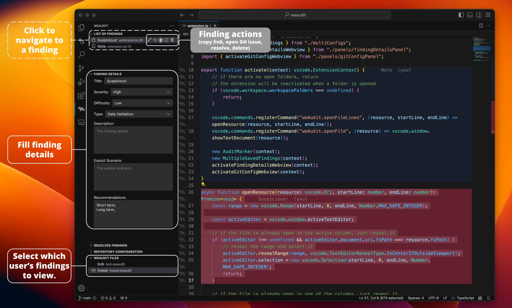

## Installation

Install weAudit directly from [weAudit @ VSCode Marketplace](https://marketplace.visualstudio.com/items?itemName=trailofbits.weaudit).

See the [Build and install](#build-and-install) section below for how to build and install from source.


## Features

-   [**Findings and Notes**](#findings-and-notes) - Bookmark regions of code to identify findings or to add audit notes.
-   [**Audited Files**](#audited-files) - Mark an entire file as reviewed.
-   [**Partially Audited Files**](#partially-audited-files) - Mark a region of code as reviewed.
-   [**Detailed Findings**](#detailed-findings) - Fill detailed information about a finding.
-   [**GitHub/Gitlab Issues**](#githubgitlab-issues) - Create formatted GitHub or Gitlab issues with the Detailed Findings information.
-   [**Multi-region Findings**](#multi-region-findings) - Group multiple locations under a single finding.
-   [**Resolve and Restore**](#resolve-and-restore) - Resolved notes and triaged findings will not be highlighted in the editor but remain visible in the sidebar.
-   [**Copy Permalinks**](#copy-permalinks) - Copy GitHub permalinks to findings, or to a selected code region.
-   [**Daily Log**](#daily-log) - View a daily log of all the marked files and LOC per day.
-   [**View Mode**](#view-mode) - View findings in a list, or grouped by filename.
-   [**Multiple Users**](#multiple-users) - Findings can be viewed from multiple different users.
-   [**Hide Findings**](#hide-findings) - Hide all findings associated with a specific user.
-   [**Auto Sync (Git)**](#auto-sync-git) - Automatically sync .weaudit files across auditors via a dedicated branch.
-   [**Search & Filter Findings**](#search--filter-findings) - Search and filter the findings in the _List of Findings_ panel.
-   [**Export Findings**](#export-findings) - Export findings to a markdown file.
-   [**Drag & drop Findings and Locations**](#drag--drop-findings-and-locations) - Drag and drop findings and locations in the _List of Findings_ panel.
-   [**Settings**](#settings) - Customize colors and general preferences.

---

### Findings and Notes

Findings and notes can be added to the current selection by calling the `weAudit: New Finding from Selection` or `weAudit: New Note from Selection` commands, or their respective keyboard shortcuts. The selected code will be highlighted in the editor, and an item added to the _List of Findings_ view in the sidebar.

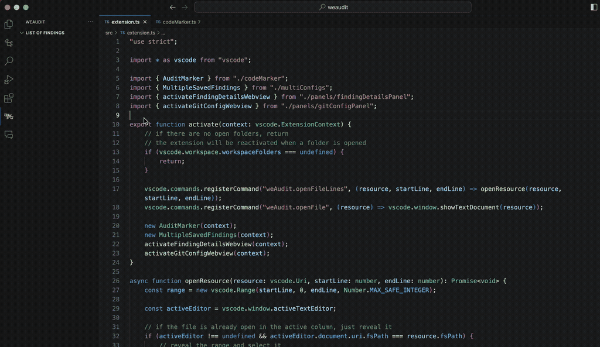

Clicking on a finding in the _List of Findings_ view will navigate to the region of code previously marked.
In the _List of Findings_ view, finding icons are tinted by severity when a severity is set.

A file with a finding will have a `!` annotation that is visible both in the file tree, and in the file name above the editor.

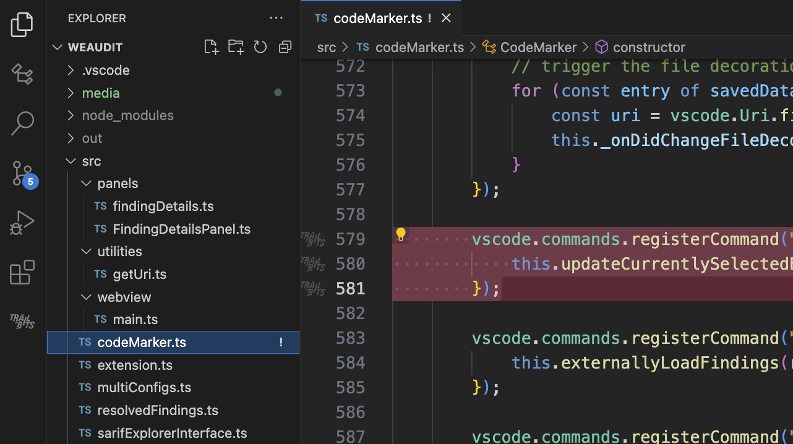

The highlighted colors can be customized in the [settings](#settings).

### Audited Files

After reviewing a file, you can mark it as audited by calling the `weAudit: Mark File as Reviewed` command, or its respective keyboard shortcut. The whole file will be highlighted and annotated with a `✓` in the file tree, and in the file name above the editor.

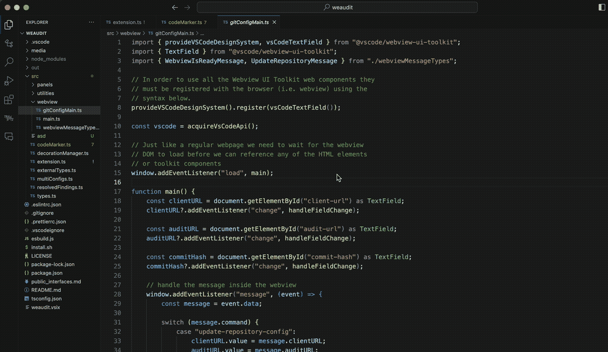

The highlighted color can be customized in the [settings](#settings).

### Partially Audited Files

You can also partially mark a file as reviewed by selecting a region of code and calling the `weAudit: Mark Region as Reviewed` command. Partially reviewed regions can be merged together by calling the same command on a region containing.
If called on a region:
 - that matches an already audited region, the region will be unmarked.
 - containing an already audited region, the region will be extended.
 - contained in an already audited region, the region will be split into two regions.

Once a file is marked as audited with the `weAudit: Mark File as Reviewed` command, all partial regions will be discarded.

The following gif showcases all the scenarios described:


The highlighted color can be customized in the [settings](#settings).

#### Navigation Between Partially Audited Regions

You can quickly navigate through all partially audited regions in your workspace using the `weAudit: Navigate to Next Partially Audited Region` command. This command will cycle through each partially audited region across all files, helping you efficiently review your progress.

### Detailed Findings

You can fill detailed information about a finding by clicking on it in the _List of Findings_ view in the sidebar. The respective _Finding Details_ panel will open, where you can fill the information.
The panel also shows a read-only provenance field (defaulting to "human"), with the author's username and any campaign tag shown next to it.
The Description, Exploit Scenario, and Recommendations fields auto-expand as you type, starting at roughly two lines tall, up to half the panel height, then scroll.
The action buttons at the top let you triage findings (True/False Positive), resolve notes, or open a GitHub issue.
Resolution changes are applied through those action buttons.
If the finding's commit hash does not match the current workspace commit hash, a warning banner appears in the details view.

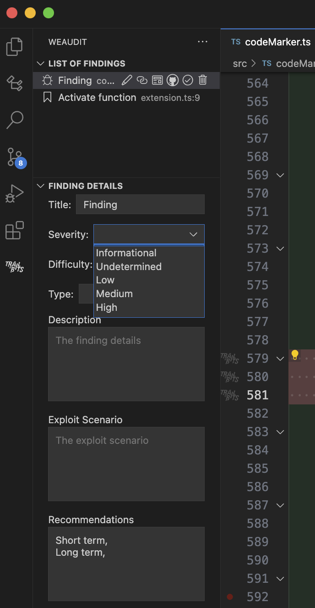

### GitHub/Gitlab Issues

You can create a GitHub/Gitlab issue with the detailed findings information by clicking on the corresponding `Open Remote Issue` button in the _List of Findings_ panel or the same button in the _Finding Details_ view. A browser window will open prompting you to open the issue with the prefilled information from the _Finding Details_ panel.

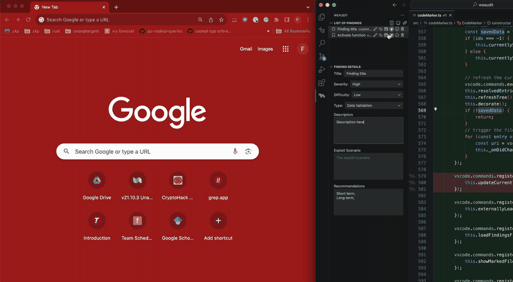

### Multi-region Findings

You can add multiple regions to a single finding or note. Once you select the code region to be added, call the `weAudit: Add Region to a Finding` and select the finding to add the region to from the quick pick menu. The regions will be highlighted in the editor, and the finding will be updated in the _List of Findings_ panel.
In the _List of Findings_ view, multi-location entries are collapsed by default; expand them to see each location's label and description.

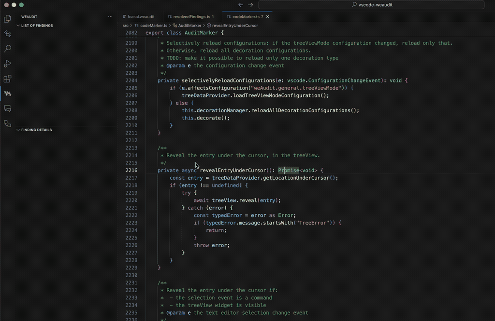

### Boundary Editing

Need to tweak the highlighted range for an existing finding? Run the `weAudit: Edit Finding Boundary` command to enter boundary editing mode. weAudit shows a set of inline CodeLens controls at the top and bottom of the region so you can expand, shrink, or move the selection and click `Done` when you are satisfied.

You can also use the dedicated keyboard shortcuts to make quick adjustments without touching the mouse. These shortcuts automatically focus the relevant finding, so you can adjust boundaries from the keyboard only.

### Resolve and Restore

Notes can be resolved from the _List of Findings_ panel. Findings are triaged instead: mark them as `True Positive` or `False Positive` from the same panel. Resolved notes and triaged findings are no longer highlighted in the editor but remain visible in the _Resolved Findings_ panel with a status badge and a ✅/❌ indicator for true/false positives. Resolved findings keep their severity-tinted bug icon in the _Resolved Findings_ panel to make triaged items easier to scan. The _Resolved Findings_ panel is collapsed by default in the weAudit sidebar; expand it when you need to review or restore entries. You can restore any resolved entry by clicking the corresponding `Restore` button in the _Resolved Findings_ panel.
When commit filtering is enabled, the _Resolved Findings_ panel follows the same commit hash rules as the main list.

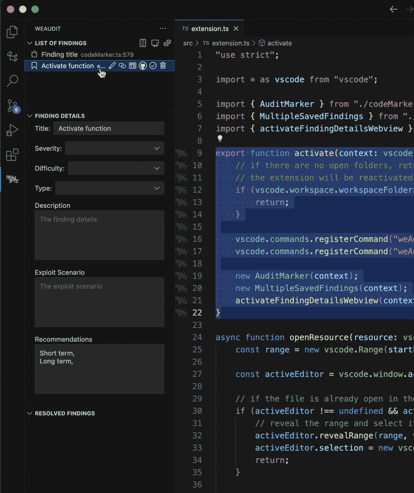

### Copy Permalinks

Copy the Audit permalink by clicking on the corresponding `Copy Audit Permalink` button in the _List of Findings_ panel.

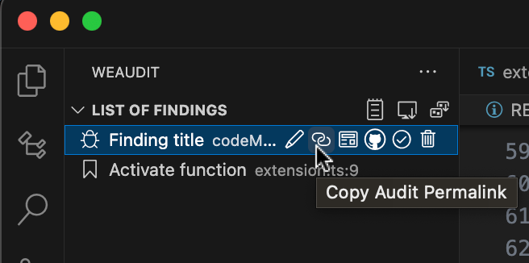

Copy a permalink to any code region by right clicking and selecting one of the `weAudit: Copy Permalink` options in the context menu.

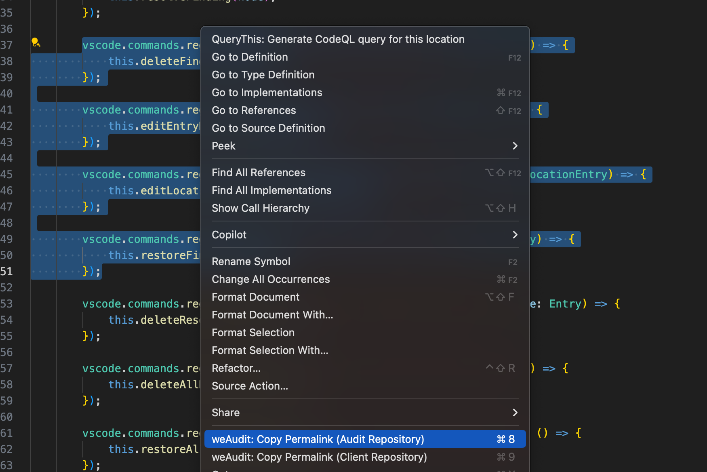

### Daily Log

You can view a daily log of all the marked files and LOC per day by clicking on the `Daily Log` button in the _List of Findings_ panel.

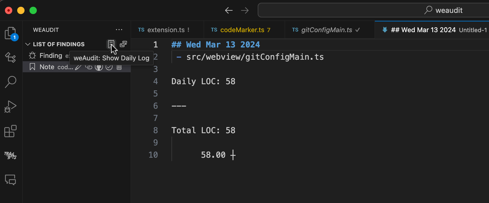

You can also view the daily log by calling the `weAudit: Show Daily Log` command in the command pallette, or its respective keyboard shortcut.

### View Mode

You can view findings in a list, or grouped by filename by clicking on the `View Mode` button in the _List of Findings_ panel.

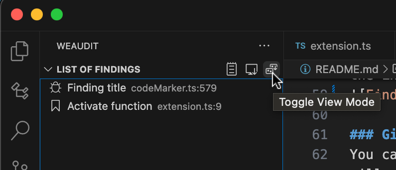

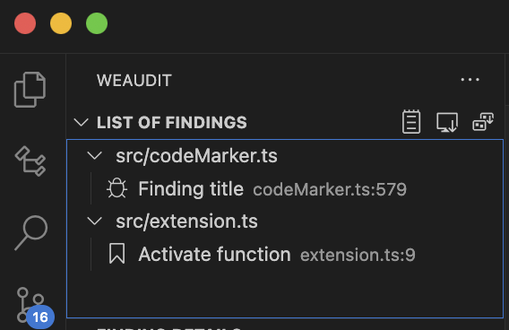

### Multiple Users

You can share the weAudit file with you co-auditors to share findings. This file is located in the `.vscode` folder in your workspace named `$USERNAME.weaudit`.

In the `weAudit Files` panel, you can toggle to show or hide the findings from each user by clicking on the entries. The `weAudit Files` panel is collapsed by default in the weAudit sidebar; expand it to manage contributors.
Newly discovered `.weaudit` files are shown automatically by default; use the panel to hide them if needed.
There are color settings for other user's findings and notes, and for your own findings and notes.
Findings and notes show the author's username after the filename/line number in the _List of Findings_ panel.

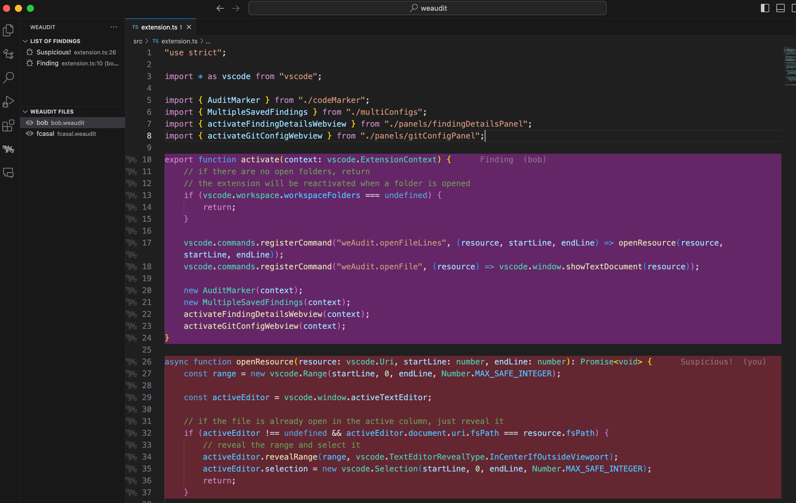

### Third-party .weaudit compatibility

weAudit can read `.weaudit` files generated by third-party tools. If a file omits `auditedFiles` or `resolvedEntries`, weAudit treats them as empty so findings can still load.
Entries without any locations are shown in the tree, but they cannot be navigated or have permalinks until a location is added.

### Hide Findings
You can hide all findings associated with a specific user by clicking on that user's name on the  `weAudit Files` panel.

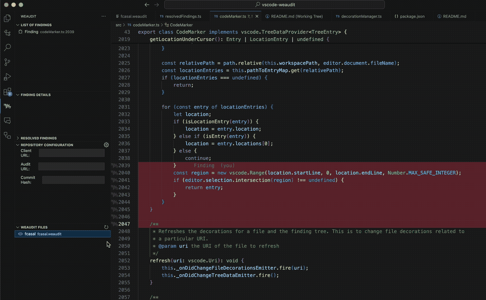

### Auto Sync (Git)
weAudit can automatically sync `.weaudit` files across auditors using git.

**Modes**
- **Central repo (default):** syncs all `.weaudit` files to a separate centralized git repository (ideal for read-only clones). The central repo URL is stored globally, but each workspace's mode controls whether it is used.
- **Repo branch:** uses a dedicated sync branch (default: `weaudit-sync`) on a remote in each repo.

In central repo mode, each repository is assigned a repo key derived from its git remote. If any remote lives under the `trailofbits` GitHub organization, that remote is preferred when building the key.

To enable, set `weAudit.sync.enabled` to `true` in your settings. By default, weAudit:
- pulls the latest sync branch before committing local `.weaudit` changes;
- polls every minute for remote updates (configurable);
- syncs only `.vscode/*.weaudit` files (daily log data stays local).

Repo-branch sync runs from a dedicated git worktree stored in VS Code's global storage, so your current branch and working tree stay untouched. Central repo sync uses a dedicated clone in the same global storage location.
Sync operations are serialized per repo across VS Code windows on the same machine. When another window is already syncing, weAudit waits briefly for the lock; if it remains busy, the sync is skipped and will retry on the next poll or change. If a pull/rebase conflict occurs, weAudit shows a warning toast and leaves local changes queued for the next sync attempt.
On extension shutdown, weAudit performs a best-effort sync flush (up to about 3 seconds). VS Code extensions cannot hard-block app/window close, so shutdown can still interrupt in-flight sync operations.

You can configure these settings in the **Sync Configuration** panel in the weAudit sidebar.
The panel shows the timestamp of the last successful sync.

You can trigger a manual sync at any time with the `weAudit: Sync Findings Now` command.

### Toggle Highlights
Hide every findings/notes highlight in the editor by running the `weAudit: Toggle Findings Highlighting` command from the Command Palette. Run the command again to bring the highlights back whenever you need to review them.

### Search & Filter Findings
You can search for and filter the findings in the `List of Findings` panel by calling the `weAudit: Search and Filter Findings` command.
By default, the `List of Findings` panel shows only findings that match the workspace commit hash. If either the finding hash or current workspace hash is unavailable, the finding stays visible. Use the `Show All Findings` command in the panel toolbar to reveal findings from other commits (notes remain visible). When the workspace opens, weAudit notifies you if there are hidden findings from other commits.
If weAudit cannot resolve `HEAD` for a workspace root, it now shows an error and does not fall back to the persisted `gitSha` value for commit filtering.

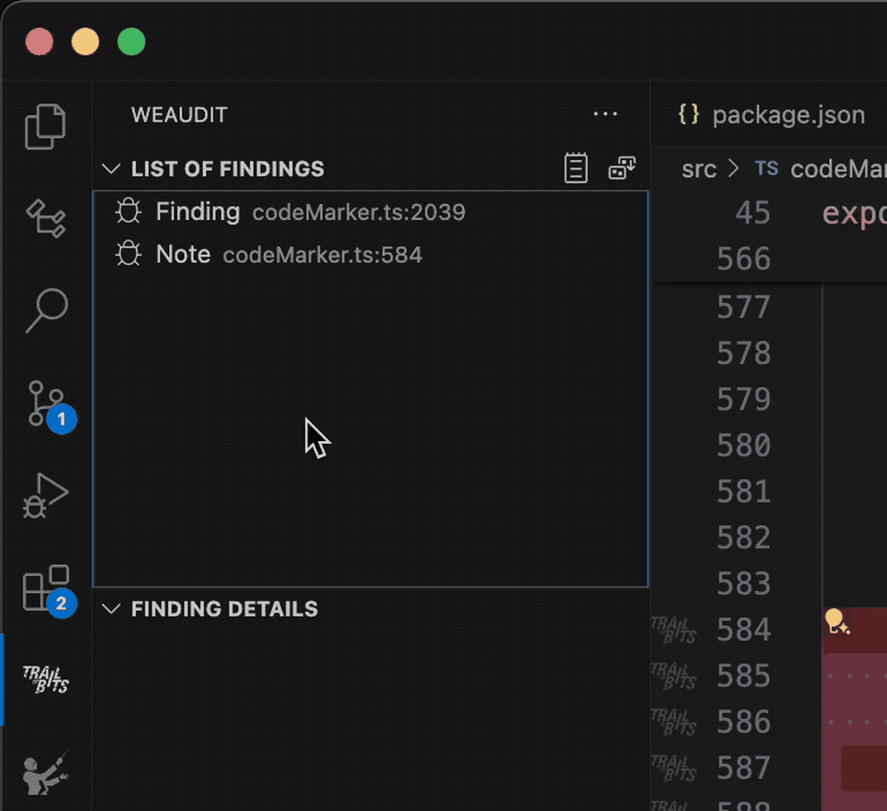

### Export Findings
You can export the findings to a markdown file by calling the `weAudit: Export Findings as Markdown` command.

### Drag & Drop Findings and Locations
You can drag and drop findings and locations in the _List of Findings_ panel to:
- drag a location (from a multi location finding) into another finding;
- drag a location (from a multi location finding) to create a separate finding;
- drag a multi-location finding into another finding, moving all locations into it;
- reorder locations within a single finding.


### Settings

#### General settings

-   `weAudit.general.treeViewMode`: The List of Findings display mode ("list" or "byFile")
-   `weAudit.general.githubOrganizationName`: Organization name for audit repository (enhances permalink heuristic)
-   `weAudit.general.username`: Username to use as finding's author (defaults to system username if empty)
-   `weAudit.general.permalinkSeparator`: Separator to use in permalinks (\\n is interpreted as newline)

#### Sync settings

-   `weAudit.sync.enabled`: Enable git-based auto sync (opt-in)
-   `weAudit.sync.mode`: Sync mode ("repo-branch" or "central-repo")
-   `weAudit.sync.remoteName`: Git remote to use (default: "origin")
-   `weAudit.sync.branchName`: Sync branch name (default: "weaudit-sync")
-   `weAudit.sync.centralRepoUrl`: Centralized git repository URL for multi-repo sync
-   `weAudit.sync.centralBranch`: Branch name in the centralized sync repository (default: "weaudit-sync")
-   `weAudit.sync.repoKeyOverride`: Optional override for the repo key used in centralized sync
-   `weAudit.sync.pollMinutes`: Remote polling interval in minutes (default: 1)
-   `weAudit.sync.debounceMs`: Debounce delay for local changes in milliseconds

Repo-branch settings are stored per-workspace. Central repo settings (mode, central repo URL/branch, and optional override) are stored globally.

#### Background colors

Each background color is customizable via the VSCode settings page. Write as #RGB, #RGBA, #RRGGBB or #RRGGBBAA:

-   `weAudit.auditedColor`: Background color for files marked as audited
-   `weAudit.{other,own}findingColor`: Background color for findings
-   `weAudit.{other,own}noteColor`: Background color for notes

#### Keybindings

You can configure the keybindings to any of the extension's commands in the VSCode settings. The default shortcuts are:

-   `weAudit.addFinding`: Add Selected Code To Findings: `cmd + 3`
-   `weAudit.addNote`: Add Selected Code To Notes: `cmd + 4`
-   `weAudit.deleteLocationUnderCursor`: Delete Finding Under Cursor: `cmd + 5`
-   `weAudit.editEntryUnderCursor`: Edit Finding Under Cursor: `cmd + 6`
-   `weAudit.toggleAudited`: Mark Current File As Reviewed: `cmd + 7`
-   `weAudit.addPartiallyAudited`: Mark Region As Reviewed: `cmd + shift + 7`
-   `weAudit.copySelectedCodePermalink`: Copy Permalink (for the Selected Code Region): `cmd + 8`
-   `weAudit.copySelectedCodeClientPermalink`: Copy Client Permalink (for the Selected Code Region): `cmd + 9`
-   `weAudit.navigateToNextPartiallyAuditedRegion`: Navigate to Next Partially Audited Region: `cmd + 0`
-   `weAudit.boundaryExpandUp`: Expand Finding Up: `cmd + shift + numpad7`
-   `weAudit.boundaryMoveUp`: Move Finding Up: `cmd + shift + numpad8`
-   `weAudit.boundaryShrinkTop`: Shrink Finding from Top: `cmd + shift + numpad9`
-   `weAudit.boundaryExpandDown`: Expand Finding Down: `cmd + shift + numpad1`
-   `weAudit.boundaryMoveDown`: Move Finding Down: `cmd + shift + numpad2`
-   `weAudit.boundaryShrinkBottom`: Shrink Finding from Bottom: `cmd + shift + numpad3`
-   `weAudit.editFindingBoundary`: Start Boundary Editing (when not editing): `cmd + shift + numpad5`
-   `weAudit.stopEditingBoundary`: Finish Boundary Editing (when editing): `cmd + shift + numpad5`

## WeAudit Concepts

-   **Findings and Notes**: A region of code that is of interest. Findings can be marked as "Resolved" or "Restored". There is no actual difference between findings and notes, except that they can be assigned different colors and that findings are displayed before notes in the _List of Findings_ panel.
-   **Audited Files**: A file that has been reviewed. This is a binary state, either a file is audited or it is not.
-   **Audit and Client Repositories**:
    -   **Audit Repository**: The repository where issues should be created. This is usually the Trail of Bits repository with the code being audited.
    -   **Client Repository**: The repository that the Audit Repository mirrors. This is used to create permalinks to include in the report.


## Development

### Build and install

To build and install a new vsix file run the following script:

```bash
npm install
./install.sh
```

### Linting and Formatting

We use ESLint and Biome to enforce a consistent code style.

```bash
# run ESLint
npx eslint -c .eslintrc.cjs .

# run Biome formatter
npx biome format --write .
```
